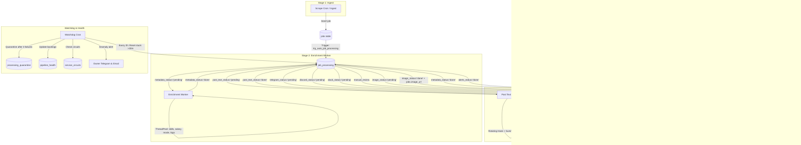

# VisaLane Pipeline State Machine Architecture

## 1. System Overview

VisaLane operates on a **5-stage queued, watched, metric-emitting state machine** hosted on GitHub Actions, Python 3.11/3.14, and Supabase at $0 operating cost.

---

## 2. Pipeline Stages

| Stage | Worker / Trigger | Prerequisite | Outputs | Failure Behavior |
|-------|------------------|--------------|---------|------------------|
| **1. Ingest** | `daily-jobs.yml`, `europe-jobs.yml` | None | `jobs` row + `job_processing` row | Retry on next scrape, circuit breaker per source |
| **2. Enrich** | `enrichment_worker.py` | `jobs` row | `skills`, `salary_*`, `work_mode`, `company_logo_url` | Field-level NULL; attempts +1, max 3 -> quarantine |
| **3. Alerts** | `alert_worker.py` | `metadata_status='done'` | Instant notifications sent, `alert_sent_jobs` | Channel isolation (one dead channel doesn't block others) |
| **4. Images** | `image_worker.py` | `metadata_status='done'` | `job-cards/{id}.png` in Storage, `jobs.image_url` | Attempts +1, max 3 -> quarantine |
| **5. Post Text** | `post_text_worker.py` | `image_status='done'` | `job_processing.post_text` JSON payload | Attempts +1, max 3 -> quarantine |
| **6. Publish** | `platform_publisher.py` | `post_text_status='done'` | Post URL, `jobs.*_post_published = true` | Pacing checked, manual review routing for LinkedIn/X |

---

## 3. Reliability Primitives

### Circuit Breakers (`service_circuits`)
- External services (AI providers, Wikimedia, scrapers, APIs) are wrapped in database-backed circuit breakers.
- **States**: `closed` -> `open` (after 5 consecutive failures) -> `half_open` (after 30-minute cooldown) -> `closed` (on success).

### Dead-Letter Quarantine (`processing_quarantine`)
- Any job that fails 3 attempts at any stage is automatically quarantined with its payload and error trace.
- Quarantined jobs do not block future jobs from progressing.
- The Watchdog alerts the owner immediately when new quarantines occur.

### Daily Aggregated Metrics (`metrics_daily`)
- Atomic single-row daily metrics (`day`, `metric`, `count`, `error_count`, `sum_ms`).
- Dashboard endpoints read aggregated rows directly — zero raw event scans.
